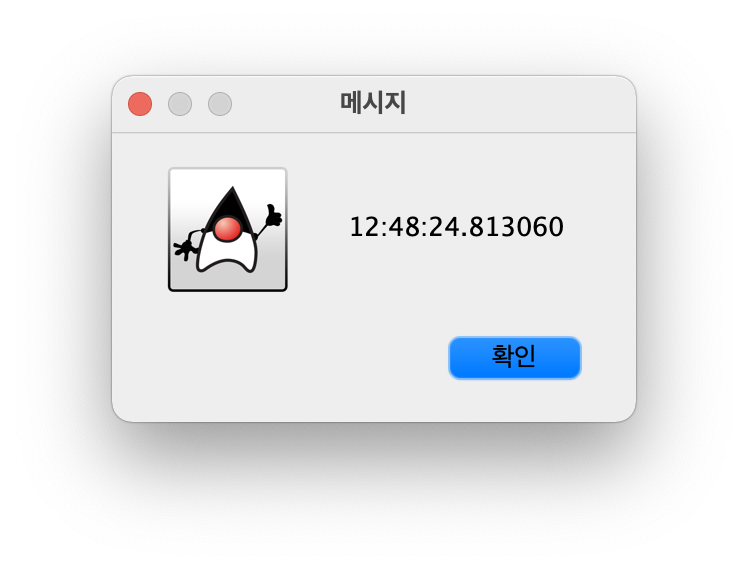

## Practice #01

### Preparation

- Obtain an educational license for IntelliJ from [this page](https://www.jetbrains.com/shop/eform/students) (You must use an academic email address such as `@hanyang.ac.kr`).
- Install [IntelliJ](https://www.jetbrains.com/ko-kr/idea/download/) on your personal computer. (If you don’t have a personal computer, install it on a lab PC for now, and later on your own computer.)
- As demonstrated during the lecture, write and run the `Hello, World!` application exactly as described in the lecture notes, and confirm that it works without issues.

### [Exercise] Current Time Printing Application

- The following two applications print the current time.
  Run each one and check what results are produced.

#### Console Output Version

```java
import java.time.*;

public class Clock {
  public static void main(String[] args) {
    System.out.println(LocalTime.now());
  }
}
```

- Identify the objects that appear when this application is executed, and draw a diagram to trace the execution, showing which object sends which message to which other object.

#### Swing package Version

```java
import javax.swing.*;
import java.time.*;

public class Clock {
  public static void main(String[] args) {
    JOptionPane.showMessageDialog(null, LocalTime.now());
  }
}
```



- Identify the objects that appear when this application is executed, and draw a diagram to trace the execution, showing which object sends which message to which other object.

