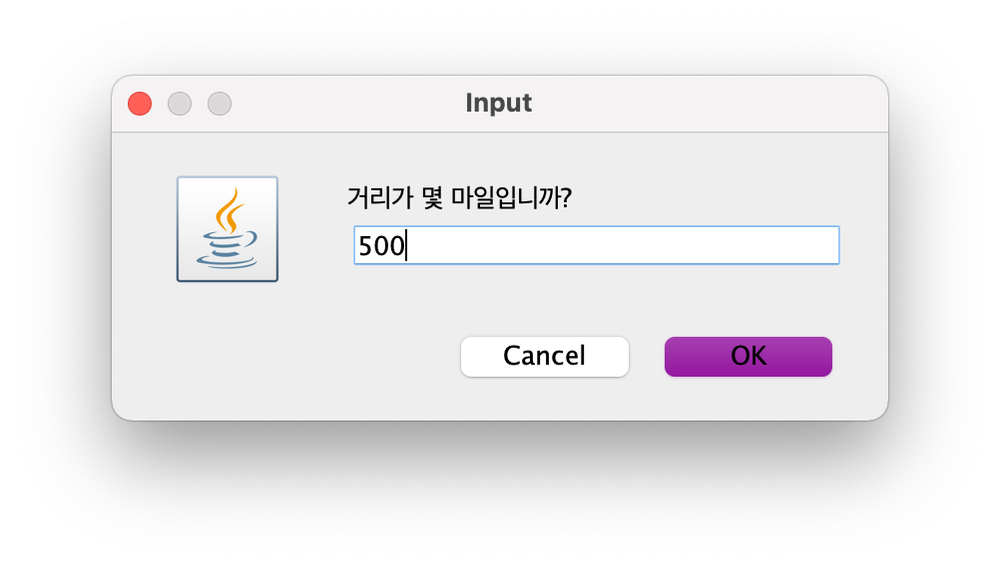
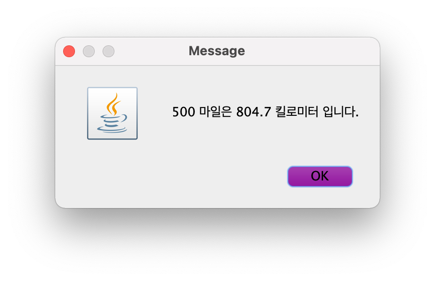
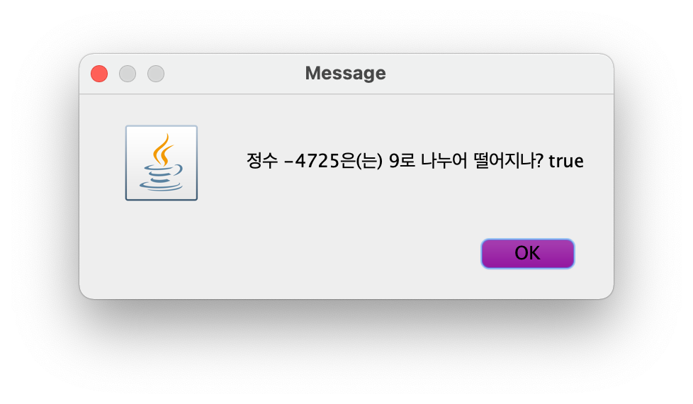
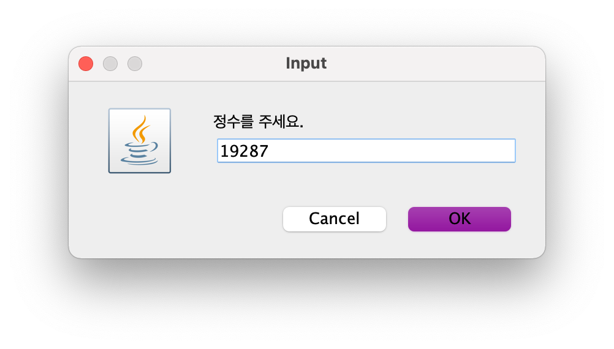
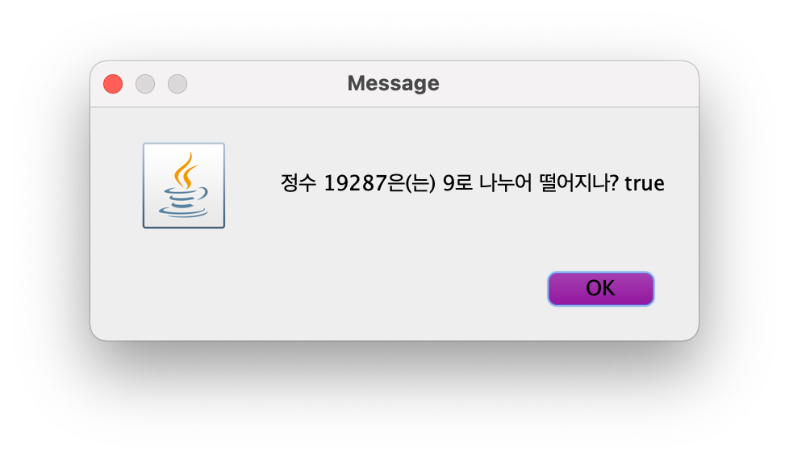

# [COM2018] 2025 Fall Object-oriented Programming
## School of Computer Science, College of Computing, Hanyang University ERICA

- This is a practice exercise to create applications that use the `showInputDialog` method provided by `JOptionPane` from the `javax.swing` package to receive user input through input dialogs, and output calculation results using the `showMessageDialog` method in message windows.
- Complete the exercises within the practice session time and have them checked by the teaching assistant.

## [Lab 2-1] Convert Miles to Kilometers

English-speaking countries use different measurement units from the global standard. For distance, they use `mile` instead of `km`, where 1 mile equals 1.60934 km.

Create an application that takes a distance in `mile` as an integer input and converts it to `km`, displaying the result in a message window in the following format, following the skeleton code format below. Express the converted distance to only one decimal place.





```java
import java.text.*;
import javax.swing.*;

public class Mi2Km {
    public static void main(String[] args) {
        // TODO
    }
}
```

## [Lab 2-2] Easy Way to Check if a Number is Divisible by 9

Create an application that takes an integer between `-99999` and `99999` as input and displays whether the number is divisible by 9 in a message window in the following format, following the skeleton code format below.




```java
import javax.swing.JOptionPane;

public class DivisibleBy9 {
    public static void main(String[] args) {
        // TODO
    }
}
```

#### * Hint

If the remainder when a number is divided by 9 equals `0`, then the number is divisible by 9.

## [Lab 2-3] Hard Way to Check if a Number is Divisible by 9

Integers satisfy the following property:

> If the sum of digits is divisible by 9, then the number itself is divisible by 9.

For example, `423`, `-4725`, and `19287`, which are all divisible by 9, have digit sums of `9`, `18`, and `27` respectively, all of which are divisible by 9.

- `423`: 4 + 2 + 3 = 9
- `-4725`: 4 + 7 + 2 + 5 = 18
- `19287`: 1 + 9 + 2 + 8 + 7 = 27

Create an application that takes a <u>**five-digit**</u> integer between `-99999` and `+99999` as program input and displays whether the sum of its digits is divisible by 9 in a message window in the following format, using the above property and following the skeleton code format below.





```java
import javax.swing.JOptionPane;

public class DivisibleBy9Hard {
    public static void main(String[] args) {
        // TODO
    }
}
```

Assume that user input will always be values between 10000 and 99999 inclusive, or between -99999 and -10000 inclusive (no other inputs will be provided).

#### * Hint 1

Specific digits of a five-digit integer can be obtained using the following methods:

1. The lowest digit of integer `n` is the remainder when the absolute value of `n` is divided by 10.
2. The second digit of integer `n` is the remainder when the quotient of the absolute value of `n` divided by 10 is divided by 10.
3. The third digit of integer `n` is the remainder when the quotient of the absolute value of `n` divided by 100 is divided by 10.
4. The fourth digit of integer `n` is the remainder when the quotient of the absolute value of `n` divided by 1000 is divided by 10.
5. The fifth digit of integer `n` is the remainder when the quotient of the absolute value of `n` divided by 10000 is divided by 10.

#### * Hint 2

The absolute value of `n` is calculated using `Math.abs(n)`.