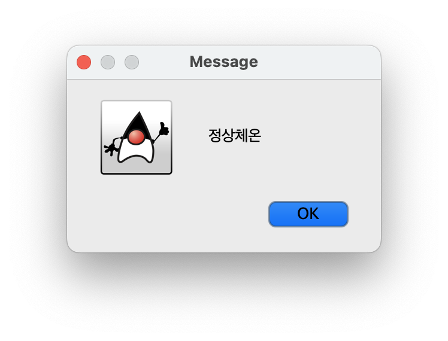
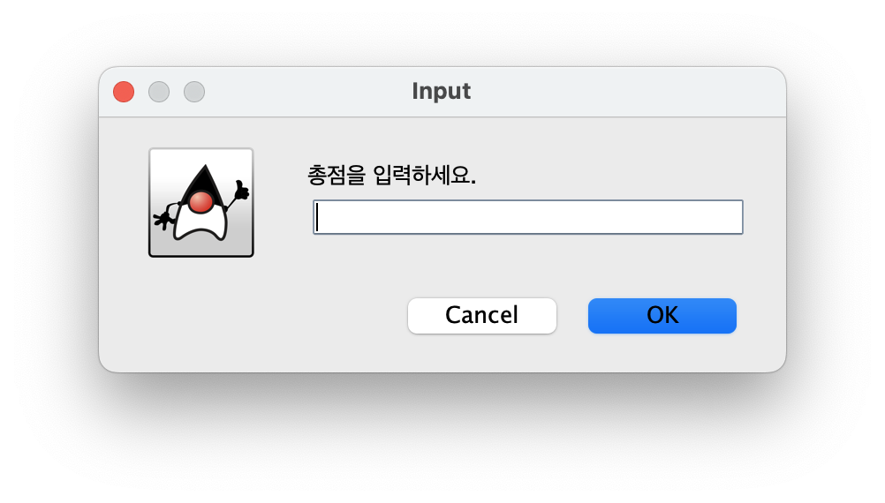
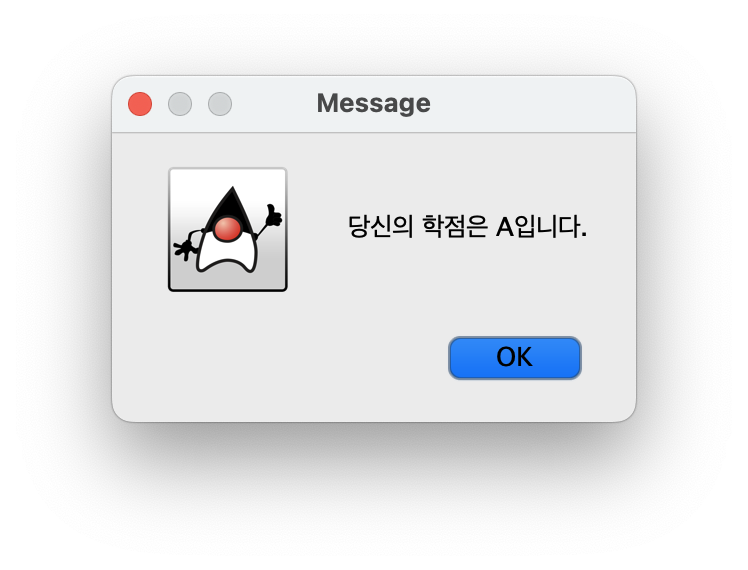
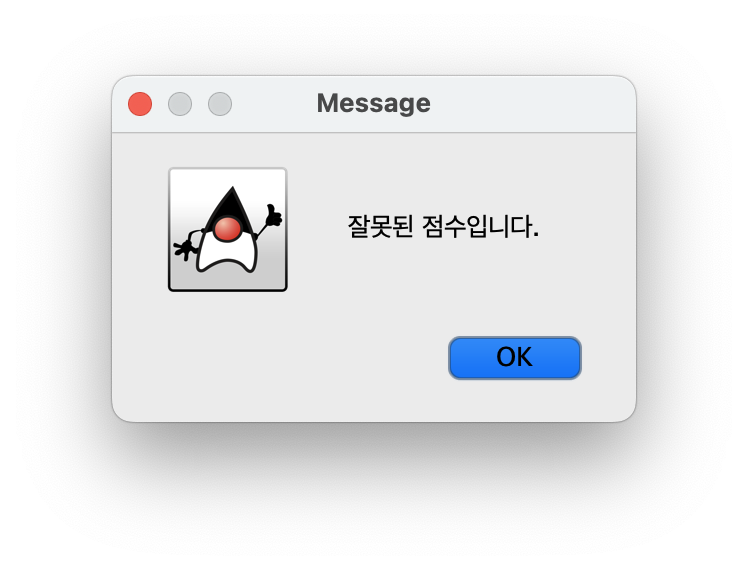
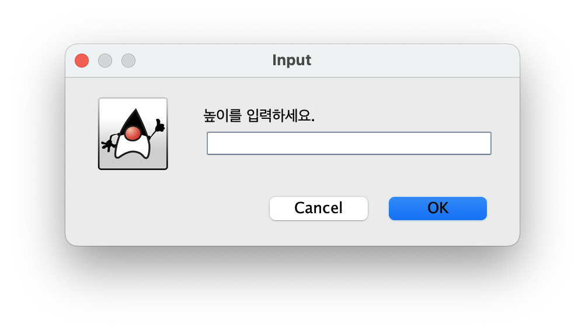

# [COM2018] 2025년도 가을학기 객체지향 프로그래밍
## 한양대학교 ERICA 소프트웨어융합대학 컴퓨터학부

- `if`, `switch`, `while`, `for` 문을 활용해봅시다.
- 실습 시간 안에 완성하여 조교에게 검사 받으세요.

## [실습 3-1] 체온을 입력받아 발열 판정하기

(측정 부위에 따라 차이가 있지만) 36도에서 37.4도 사이를 정상 체온이라고 한다.
38도 이상일 경우에는 고열(fever), 그리고 35도 이하인 경우에는 저체온(hypothermia) 이라고 한다.

실수 타입의 체온을 입력 창으로 입력받아서 온도에 따라 `정상체온`, `고열`, `저체온` 중 하나를 메시지 창으로 띄워주는 코드를 작성하자.




```java
import javax.swing.*;

public class Termometer {
    public static void main(String[] args) {
        // TODO
    }
}
```

## [실습 3-2] 간단 성적 출력기

`0`에서 `100` 사이의 정수 타입 점수를 입력창으로 받아서 학점을 출력하는 프로그램을 작성해보자.
점수가 90점 이상인 경우 `A`,
80점대인 경우 `B`,
70점대인 경우 `C`,
60점대인 경우 `D`,
60점 미만인 경우에는 `F`를 메시지로 띄우면 된다.



점수 입력이 정상적인 경우에는 학점을 출력해준다.



비정상적인 점수(0 미만이거나 100 초과)를 입력한 경우에는 다음과 같이 오류 메시지를 출력해준다.



```java
import javax.swing.JOptionPane;

public class SimpleGrade {
    public static void main(String[] args) {
        // TODO
    }
}
```

#### * 힌트

- 점수를 여러번 입력받는게 아니라 총점 개념으로 한번만 입력받는다.
- 입력받은 총점을 `10`으로 나눈 몫을 기준으로 `switch` 문을 작성하면 된다.
- 비정상적인 점수 여부는 `if` 문을 사용해보자.

## [실습 3-3] 명령 문자열 처리기 재작성하기

아래 프로그램은 명령 문자열을 입력받아서 상태 메시지를 출력하는 프로그램이다.
`if`문을 사용해서 작성한 코드를 `switch` 문으로 바꿔서 만들어보자.
입력이 대소문자를 가리지 않고 잘 작동하도록 아래 메소드를 활용한다.

- `command.toLowerCase()`

```java
import javax.swing.*;

public class CommandProcess {
    public static void main(String[] args) {
        String command = JOptionPane.showInputDialog("Input Command");

        String status_log = "unknown";
        if ("start".equals(command)) {
            status_log = "Starting...";
        } else if ("stop".equals(command)) {
            status_log = "Stopping...";
        } else if ("pause".equals(command)) {
            status_log = "Pausing...";
        } else if ("resume".equals(command)) {
            status_log = "Resuming...";
        }

        System.out.println(status_log);
    }
}
```

## [실습 3-4] 별 피라미드

피라미드의 높이 `n` 을 입력받아서 좌측정렬 피라미드를 출력하는 프로그램을 작성해보자.

피라미드의 높이는 다음과 같이 입력창으로 받는다.



예를 들어 5를 입력받았다면 다음과 같은 피라미드를 출력하면 된다.
```
*
**
***
****
*****
```

먼저 `for` 문으로 작성하고,

```java
import javax.swing.*;

public class PyramidPrinterFor {
    public static void main(String[] args) {
        int n = Integer.parseInt(JOptionPane.showInputDialog("높이를 입력하세요."));
        for (...) {
            for (...) {
                // TODO
            }
            // TODO
        }
    }
}
```

이어서 `while` 문으로 작성해보자.

```java
import javax.swing.*;

public class PyramidPrinterWhile {
    public static void main(String[] args) {
        int n = Integer.parseInt(JOptionPane.showInputDialog("높이를 입력하세요."));
        // TODO
    }
}
```