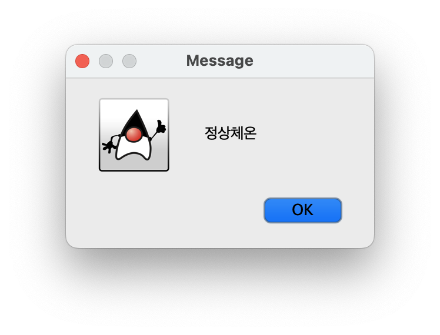
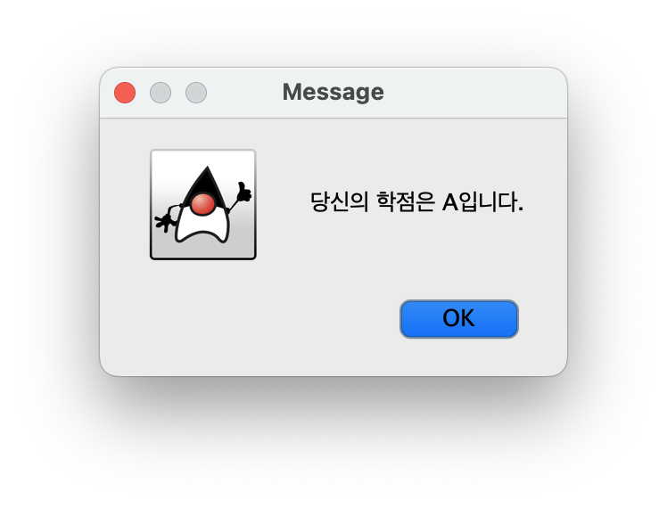

# [COM2018] 2025 Fall Object-oriented Programming
## School of Computer Science, College of Computing, Hanyang University ERICA

- Practice using `if`, `switch`, `while`, and `for` statements.
- Complete the exercises within the practice session time and have them checked by the teaching assistant.

## [Lab 3-1] Fever Detection Based on Body Temperature

(Normal range varies by measurement site, but) body temperature between 36.0℃ and 37.4℃ is considered normal.
38.0℃ or higher is regarded as fever, and 35.0℃ or lower is regarded as hypothermia.

Write a program that takes a floating-point body temperature value from an input dialog and,
depending on the value, displays a message box showing one of
`Normal`, `Fever`, or `Hypothermia`.




```java
import javax.swing.*;

public class Termometer {
    public static void main(String[] args) {
        // TODO
    }
}
```

## [Lab 3-2] Simple Grade Printer

Write a program that takes an integer score between `0` and `100` from an input dialog
and prints the corresponding grade.
• 90 or above → `A`
• 80s → `B`
• 70s → `C`
• 60s → `D`
• Below 60 → `F`


If the score is valid, display the grade.



If an invalid score (less than 0 or greater than 100) is entered, display an error message as follows:


```java
import javax.swing.JOptionPane;

public class SimpleGrade {
    public static void main(String[] args) {
        // TODO
    }
}
```

#### * Hint

- The score is entered only once (not multiple times).
- Use the quotient of the score divided by `10` as the basis for a `switch` statement.
- Use an `if` statement to check whether the score is invalid.

## [Lab 3-3] Rewriting the Command String Processor

The following program takes a command string as input and prints a status message.
Rewrite the program so that instead of using `if` statements,
it uses a `switch` statement.
Make sure it works regardless of case by using the method below:

- `command.toLowerCase()`

```java
import javax.swing.*;

public class CommandProcess {
    public static void main(String[] args) {
        String command = JOptionPane.showInputDialog("Input Command");

        String status_log = "unknown";
        if ("start".equals(command)) {
            status_log = "Starting...";
        } else if ("stop".equals(command)) {
            status_log = "Stopping...";
        } else if ("pause".equals(command)) {
            status_log = "Pausing...";
        } else if ("resume".equals(command)) {
            status_log = "Resuming...";
        }

        System.out.println(status_log);
    }
}
```

## [Lab 3-4] Star Pyramid

Write a program that takes an integer n as the height of a pyramid and prints a left-aligned pyramid.

The pyramid height should be entered through an input dialog.


For example, if the input is 5, the program should output:

```
*
**
***
****
*****
```

First, implement it using a `for` loop:

```java
import javax.swing.*;

public class PyramidPrinterFor {
    public static void main(String[] args) {
        int n = Integer.parseInt(JOptionPane.showInputDialog("높이를 입력하세요."));
        for (...) {
            for (...) {
                // TODO
            }
            // TODO
        }
    }
}
```

Then, implement it again using a `while` loop:

```java
import javax.swing.*;

public class PyramidPrinterWhile {
    public static void main(String[] args) {
        int n = Integer.parseInt(JOptionPane.showInputDialog("높이를 입력하세요."));
        // TODO
    }
}
```