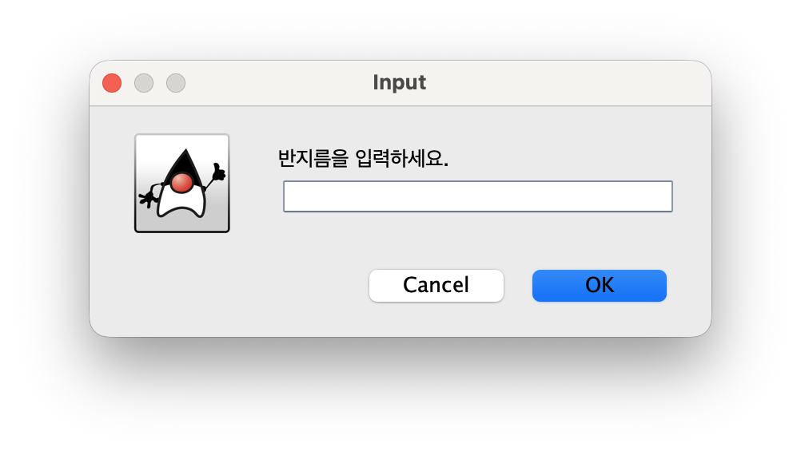
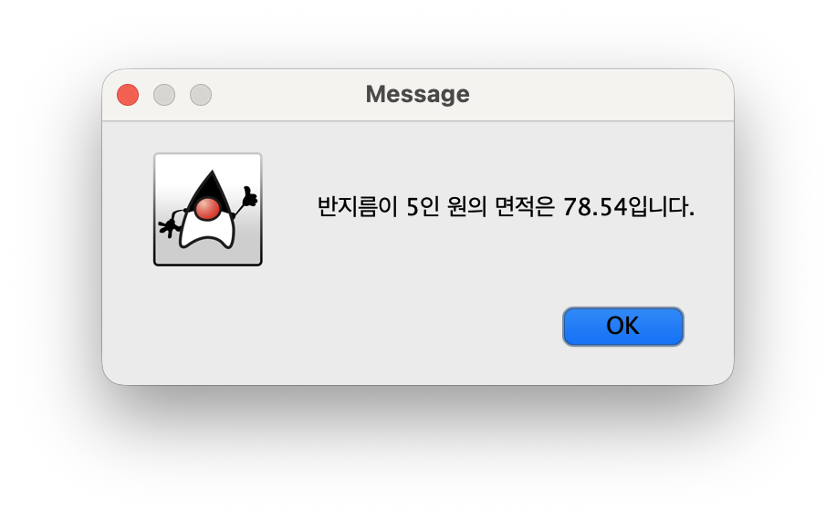
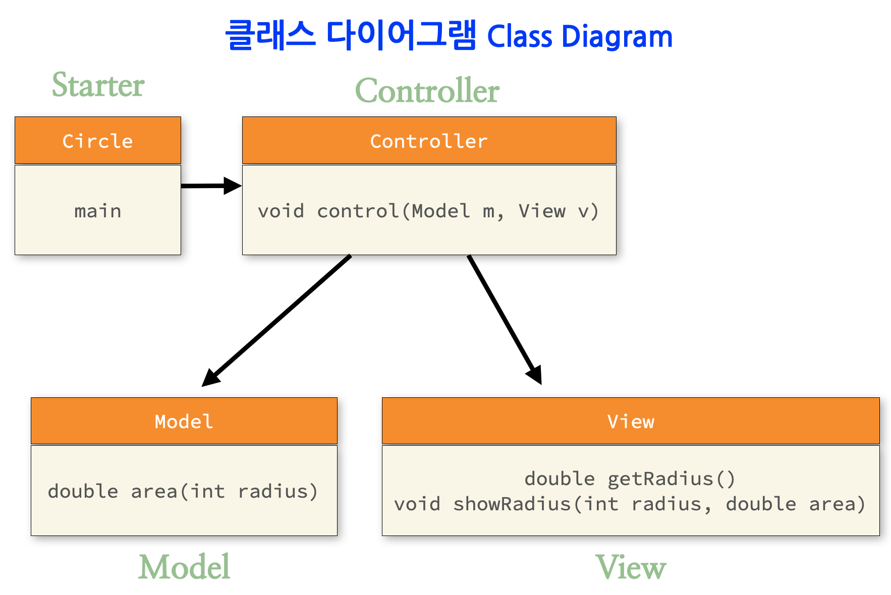

# [COM2018] 2025년도 가을학기 객체지향 프로그래밍
## 한양대학교 ERICA 소프트웨어융합대학 컴퓨터학부

- 수업 시간에 배운대로 `main` 메소드 하나에 작성한 코드 중 일부를 함수로 바꿔서 만들어 봅시다. 
- `javax.swing` 패키지의 `JOptionPane`이 제공해주는 `showInputDialog` 메소드를 활용하여 입력창으로 사용자 입력을 받고, 계산 결과는 `showMessageDialog` 메소드를 활용하여 메시지 창에 출력하는 애플리케이션을 만드는 연습입니다.
- 실습 시간 안에 완성하여 조교에게 검사 받으세요.

## [실습 4-1] 원의 면적 구하는 프로그램에서 method 만들기

```java
import java.text.DecimalFormat;

public class Circle {
    public static void main(String[] args) {
        int radius = 5;
        double area = Math.PI * radius * radius;
        DecimalFormat df = new DecimalFormat("#.##");
        System.out.println("Area of circle: " + df.format(area));
    }
}
```

1. 위 Java 코드에서 method `area` 를 분리해 작성하세요. (수업시간에 다룬 `ClassManagement`, `TextSearch` 참고)
```java
import java.text.DecimalFormat;

public class Circle {
    public double area(int raidus) {
        return 0.0;    
    }
    
    public static void main(String[] args) {
        int radius = 5;
        Circle c = new Circle();
        // ...
    }
}
```

2. 이어서 정해진 `radius` 를 사용하는 대신 
아래와 같이 메시지 창으로 사용자 입력을 받아서 처리하도록 수정하세요.
 


결과도 콘솔 대신 메시지로 출력합니다.



## [실습 4-2] MVC 모델로 나눠서 작성하기

4-1 에서 작성한 코드를 아래 MVC 구조에 맞춰서 재작성 해 보세요.


