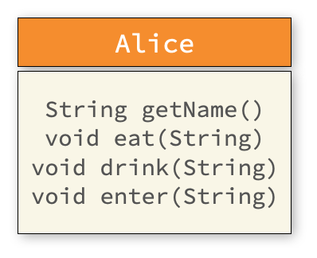
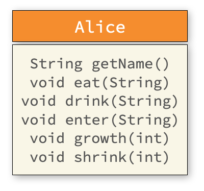
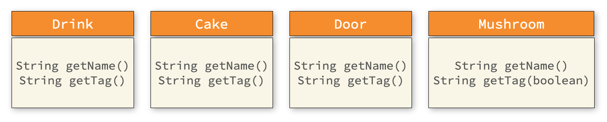

# [COM2018] 2025년도 가을학기 객체지향 프로그래밍
## 한양대학교 ERICA 소프트웨어융합대학 컴퓨터학부

- 수업시간에 배운 '이상한 나라의 앨리스'에서 앨리스의 여정을 Java 코드로 구현해봅시다.
- 실습 시간 안에 완성하여 조교에게 검사 받으세요.

## [실습 5-1] 아이템 클래스 만들기

먼저 여러가지 아이템들을 간단하게 만들어봅시다.
아래 클래스 다이어그램을 보고 `Drink`, `Cake`, `Door`, `Mushroom` 의 클래스를 만들어 봅시다.


(도움을 위해) `Drink`는 아래와 같이 간단하게 구현할 수 있습니다.

```java
public class Drink {
    public String getName() {
        return "음료";
    }
}
```

## [실습 5-2] 앨리스 클래스 만들기

이제 이어서 아래 클래스 다이어그램을 참고해서 `Alice` 클래스를 만들어 봅시다.



앨리스의 각 method 는 문자열을 입력받아 아래와 같이 관련 행동을 적절하게 출력하도록 작성하면 됩니다.

```java
public class Alice {
    public void eat(String food) {
        System.out.println("앨리스는 " + food + "을(를) 먹었습니다.");
    }

    // ...
}
```

## [실습 5-3] 시나리오 작성

클래스 `WonderLand` 를 생성하고 `main` 함수에 지금까지 구현한 코드를 활용해서
실행을 했을 때 다음과 같이 출력되도록 작성해보세요.

```
앨리스는 음료을(를) 먹었습니다.
앨리스는 케이크을(를) 먹었습니다.
앨리스는 버섯을(를) 먹었습니다.
앨리스는 문에 들어갔습니다.
```

아래 코드의 시작부분을 참고하세요.

```java
public class WonderLand {
    // First Scenario
    public static void main(String[] args) {
        Alice alice = new Alice();
        Drink drink = new Drink();
        alice.eat(drink.getName());
        // ...
```

## [실습 5-4] 앨리스의 키 변화 내역 추가하기

지금까지 구현한 코드에서는 앨리스의 키 변화를 알 수 없습니다. 이를 보완하기 위해
클래스 `Alice` 를 다음과 같이 확장해봅시다.



새로 추가한 `growth` 와 `shrink` 는 정수를 입력받아서 아래와 같이 출력하는 method 입니다.
(각각 130, 60의 값을 입력했다고 가정)

```java
    Alice alice = new Alice();
    alice.growth(130);
    alice.shrink(60);
```

```
앨리스의 키가 130cm로 커졌습니다.
앨리스의 키가 60cm로 작아졌습니다.
```


## [실습 5-5] 앨리스의 이야기 보완하기

이제 앞서 작성한 `growth`와 `shrink`를 `main` 메소드의 적절한 위치에 추가해서
전체 이야기가 아래와 같이 전개되도록 수정해보세요.

```
앨리스는 음료을(를) 먹었습니다.
앨리스는 케이크을(를) 먹었습니다.
앨리스의 키가 270cm로 커졌습니다.
앨리스는 버섯을(를) 먹었습니다.
앨리스의 키가 40cm로 작아졌습니다.
앨리스는 문에 들어갔습니다.
```

## [실습 5-6] 디테일 살리기

제일 먼저 구현했던 아이템에 대한 설명을 보강하기 위해 다음과 같이 클래스 다이어그램을 수정했습니다.



`Drink` 클래스의 `getTag` 는 아래와 같이 꾸미는 메시지를 리턴합니다.

```java
public class Drink {
    public String getTag() {
        return "Drink Me";
    }
    // ...
}
```

`WonderLand`의 `main`에서 사용할 때, 다음과 같이 수정해서 사용해야 합니다.

```java
   public static void main(String[] args) {
       Alice alice = new Alice();
       Drink drink = new Drink();
       alice.eat(drink.getTag() + "라고 쓰여진 " + drink.getName());
```

`Mushroom` 은 어느쪽을 먹냐에 따라서 설명이 달라져야 합니다.
그래서 `getTag` 함수에 `boolean` 타입의 값을 입력받아 서로 다른 메시지를 리턴해야 합니다.

- `getTag` 의 입력 값이 `true` 인 경우 : `키가 커지는 버섯` 을 리턴
- `getTag` 의 입력 값이 `false` 인 경우 : `키가 작아지는 버섯` 을 리턴

즉, 아래와 같이 작성할 경우
```java
    Alice alice = new Alice();
    // ...
    Mushroom mushroom = new Mushroom();
    alice.eat(mushroom.getName(true));
    // ...
```

실행 결과는 다음과 같아야 합니다.
```
앨리스는 키가 커지는 버섯을(를) 먹었습니다.
```

## [실습 5-7] 최종 완성하기

이제 전체 코드를 손봐서 실행결과가 다음과 같이 되도록 완성해봅시다.

```
앨리스는 Drink Me라고 쓰여진 음료을(를) 먹었습니다.
앨리스의 키가 30cm로 작아졌습니다.
앨리스는 Eat Me라고 쓰여진 케이크을(를) 먹었습니다.
앨리스의 키가 270cm로 커졌습니다.
앨리스는 키가 작아지는 버섯을(를) 먹었습니다.
앨리스의 키가 40cm로 작아졌습니다.
앨리스는 정원으로 가는 작은 문에 들어갔습니다.
```