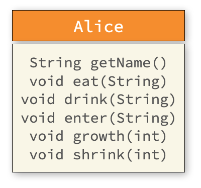
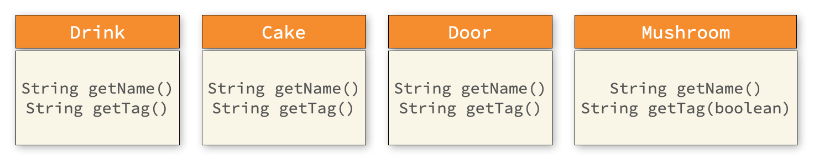

# [COM2018] 2025 Fall Object-oriented Programming
## School of Computer Science, College of Computing, Hanyang University ERICA

- Let’s implement Alice’s journey from Alice in Wonderland in Java code,
following what you learned in class.
- Complete the exercise during lab time and have it checked by the
    teaching assistant.

## [Lab 5-1] Creating Item Classes

First, let’s create several simple item classes.
Refer to the class diagram below and implement the classes `Drink`, `Cake`, `Door`, and `Mushroom`.


(For reference) `Drink` can be implemented simply as follows:

```java
public class Drink {
    public String getName() {
        return "음료";
    }
}
```

## [Lab 5-2] Creating the Alice Class

Next, using the class diagram below, implement the Alice class.


Each method of `Alice` should take a string and print an appropriate action as output, like the following:

```java
public class Alice {
    public void eat(String food) {
        System.out.println("앨리스는 " + food + "을(를) 먹었습니다.");
    }

    // ...
}
```

## [Lab 5-3] 시나리오 작성

Create a class `WonderLand`, and in its `main` method use the code you have written so far so that, when run, the following is printed:

```
앨리스는 음료을(를) 먹었습니다.
앨리스는 케이크을(를) 먹었습니다.
앨리스는 버섯을(를) 먹었습니다.
앨리스는 문에 들어갔습니다.
```

Use the following as a starting template:

```java
public class WonderLand {
    // First Scenario
    public static void main(String[] args) {
        Alice alice = new Alice();
        Drink drink = new Drink();
        alice.eat(drink.getName());
        // ...
```

## [Lab 5-4] Adding Alice’s Height-Change Log

In the current implementation, we cannot tell how Alice’s height changes.
To address this, extend the `Alice` class as follows.



Add two methods, `growth` and `shrink`, each taking an integer and printing output like below
(assuming 130 and 60 were passed, respectively):

```java
    Alice alice = new Alice();
    alice.growth(130);
    alice.shrink(60);
```

```
앨리스의 키가 130cm로 커졌습니다.
앨리스의 키가 60cm로 작아졌습니다.
```


## [Lab 5-5] Enhancing the Story

Now insert the `growth` and `shrink` calls at appropriate places in main
so that the overall story shows as follows.

```
앨리스는 음료을(를) 먹었습니다.
앨리스는 케이크을(를) 먹었습니다.
앨리스의 키가 270cm로 커졌습니다.
앨리스는 버섯을(를) 먹었습니다.
앨리스의 키가 40cm로 작아졌습니다.
앨리스는 문에 들어갔습니다.
```

## [Lab 5-6] Adding Detail

To enrich the descriptions of the items you implemented at the beginning, the class diagram is revised as follows:



For `Drink`, implement `getTag` to return a decorative label string like this:

```java
public class Drink {
    public String getTag() {
        return "Drink Me";
    }
    // ...
}
```

When using it in `WonderLand.main`, modify your code like this:

```java
   public static void main(String[] args) {
       Alice alice = new Alice();
       Drink drink = new Drink();
       alice.eat(drink.getTag() + "라고 쓰여진 " + drink.getName());
```

`Mushroom` 은 어느쪽을 먹냐에 따라서 설명이 달라져야 합니다.
그래서 `getTag` 함수에 `boolean` 타입의 값을 입력받아 서로 다른 메시지를 리턴해야 합니다.

For `Mushroom`, the label should differ depending on which side is eaten.
Therefore, make getTag accept a boolean parameter and return different messages:
- If the input to getTag is `true`: return `키가 커지는 버섯`
- If the input to getTag is `false`: return `키가 작아지는 버섯`

For example:
```java
    Alice alice = new Alice();
    // ...
    Mushroom mushroom = new Mushroom();
    alice.eat(mushroom.getName(true));
    // ...
```

Expected outout:
```
앨리스는 키가 커지는 버섯을(를) 먹었습니다.
```

## [Lab 5-7] Final Assembly

Now revise the entire code so that the program prints the following results:

```
앨리스는 Drink Me라고 쓰여진 음료을(를) 먹었습니다.
앨리스의 키가 30cm로 작아졌습니다.
앨리스는 Eat Me라고 쓰여진 케이크을(를) 먹었습니다.
앨리스의 키가 270cm로 커졌습니다.
앨리스는 키가 작아지는 버섯을(를) 먹었습니다.
앨리스의 키가 40cm로 작아졌습니다.
앨리스는 정원으로 가는 작은 문에 들어갔습니다.
```