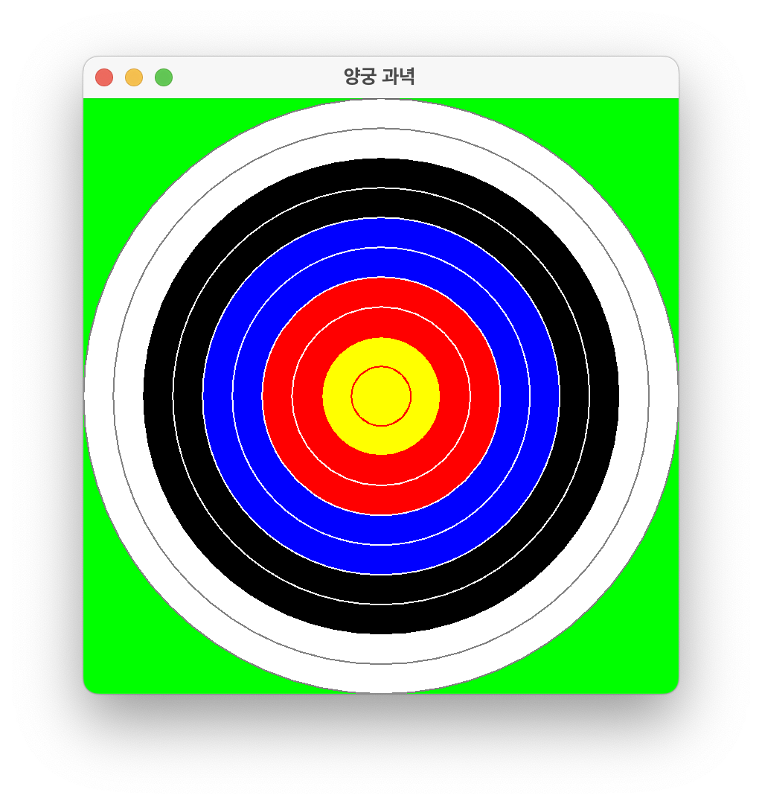

# [COM2018] 2025년도 가을학기 객체지향 프로그래밍
## 한양대학교 ERICA 소프트웨어융합대학 컴퓨터학부

- `javax.swing` 패키지의 `Graphics` 객체와 관련 메소드를 활용하여 크기가 점점 커지는 알을 그려봅시다.
- 실습 시간 안에 완성하여 조교에게 검사를 받습니다.

## [실습 6-1] 계란 그리기

- 다음을 만족하는 클래스 GrowingEgg를 생성하세요.
    - pixel 단위로 400x400 크기의 창을 생성한다.
    - 녹색 (`Color.GREEN`) 바탕에 노란색 (`Color.YELLOW`)의 알 모양 타원을 정 가운데 보여준다.
    - 알의 크기는 너비가 60, 높이가 40 pixel 이다.
    - 창의 타이틀은 `Egg` 로 한다.


```java
import java.awt.*;
import javax.swing.*;

public class GrowingEgg extends JPanel {

	public GrowingEgg() {
		JFrame f = new JFrame();
		// ...
	}

	public void paintComponent(Graphics g) {
		// ...
	}

	public static void main(String[] args) {
		new GrowingEgg();
	}
}
```

## [실습 6-2] 자라나는 알

- 다음을 만족하도록 클래스 `GrowingEgg`를 수정하세요.
    - 창을 최소화했다가 다시 활성화하면, `paintComponent` 메소드가 저절로 다시 실행되면서 창을 다시 그린다.
    - 창을 활성화 할 때 마다 알이 아래와 같이 너비 60, 높이 40 pixel 씩 자라도록 한다.
    - 알의 중심은 항상 일치해야 한다.


```java
import java.awt.*;
import javax.swing.*;

public class GrowingEgg extends JPanel {

    private final int NET_SIZE = 400;
    private int egg_width = 60;
    private int egg_height = 40;
    private int x = 170;
    private int y = 180;

    public GrowingEgg() {
        JFrame f = new JFrame();
        // ...
    }

    public void paintComponent(Graphics g) {
        // ...
    }

    public static void main(String[] args) {
        new GrowingEgg();
    }
}
```

## [실습 6-3] 조절 가능한 알

- 다음을 만족하도록 클래스 `GrowingEgg`를 수정하세요.
    - 창의 크기를 400x400으로 고정하는 대신, `GrowingEgg(400)`과 같이 창의 크기를 사용자가 정할 수 있게 애플리케이션을 개선하자.
    - 알의 크기와 자라는 비율은 창의 크기와 비례해야 한다.
    - 알의 중심은 항상 일치해야 한다.


```java
import java.awt.*;
import javax.swing.*;

public class GrowingEgg extends JPanel {

    // initialize NET_SIZE on constructor method
	private final int NET_SIZE;
	private int egg_width = 60;
	private int egg_height = 40;
    // initialize x, y on constructor method
	private int x;
	private int y;

	public GrowingEgg(int size) {
		JFrame f = new JFrame();
		// ...
	}

	public void paintComponent(Graphics g) {
		// ...
	}

	public static void main(String[] args) {
		new GrowingEgg(400);
	}
}
```

## [실습 6-4] 양궁 과녁 그리기

- 오늘 배운 GUI 요소와 while 루프를 사용해서 아래와 같은 "양궁 과녁"을 그려봅시다.
- 과녁의 패턴이 마음에 들지 않는다면 임의로 수정을 해도 좋습니다. 단 어떻게 수정했는지 조교에게 설명할 수 있어야 합니다.



```Java
import javax.swing.*;
import java.awt.*;

public class Archery extends JPanel {
    private final int RINGS = 10; // 원의 개수
    private final int TARGET_DIAMETER;

    /* Constructor Archery - 양궁 과녁 패널을 만들고 프레임에 넣음
     * @param d - 과녁의 직경 */
    public Archery(int d) {
        TARGET_DIAMETER = d;
        JFrame f = new JFrame();
        f.getContentPane().add(this);
        f.setTitle("양궁 과녁");
        f.setSize(TARGET_DIAMETER, TARGET_DIAMETER + 28);
        f.setVisible(true);
        f.setDefaultCloseOperation(WindowConstants.EXIT_ON_CLOSE);
    }

    /* paintComponent - 패널에 그림을 그림
     * @param g - 그래픽스 펜 */
    public void paintComponent(Graphics g) {
        // 녹색 바탕 색칠하기
        g.setColor(Color.green);
        g.fillRect(0,  0, TARGET_DIAMETER, TARGET_DIAMETER);
        // 링의 간격 OFFSET
        final int OFFSET = TARGET_DIAMETER / RINGS;
        int number = 1;
        int diameter = TARGET_DIAMETER;
        int new_x_position = 0;
        int new_y_position = 0;
        // 밖의 원부터 가장 안에 있는 원까지 순서대로 그린다.
        while (number <= RINGS) {
            // loop invariant (루프 불변 성질): 지금까지 number-1 개의 링을 그렸음
            if (number <= 2) {
                // TODO : 흰 배경, 회색 선으로 가장 밖의 두 원을 그린다.
                // ...
            }
            else if (number <= 4) {
                // TODO : 검은 배경, 흰색 선으로 다음 두 원을 그린다.
                // HINT : 흰색 선 하나만 그리면 된다.
                // ...
            }
            else if (number <= 6) {
                // TODO : 파란 배경, 흰색 선으로 다음 두 원을 그린다.
                // ...
            }
            else if (number <= 8) {
                // TODO : 붉은 배경, 흰색 선으로 다음 두 원을 그린다.
                // ...
            }
            else if (number <= 10) {
                // TODO : 노란 배경, 빨간 선으로 마지막 원을 그린다.
                // ...
            }
            // 반복 때마다 x, y 위치 정보와 number, diameter 를 갱신한다. 
            // ...
        }
    }

    public static void main(String[] args) {
        new Archery(400);
    }

}

```