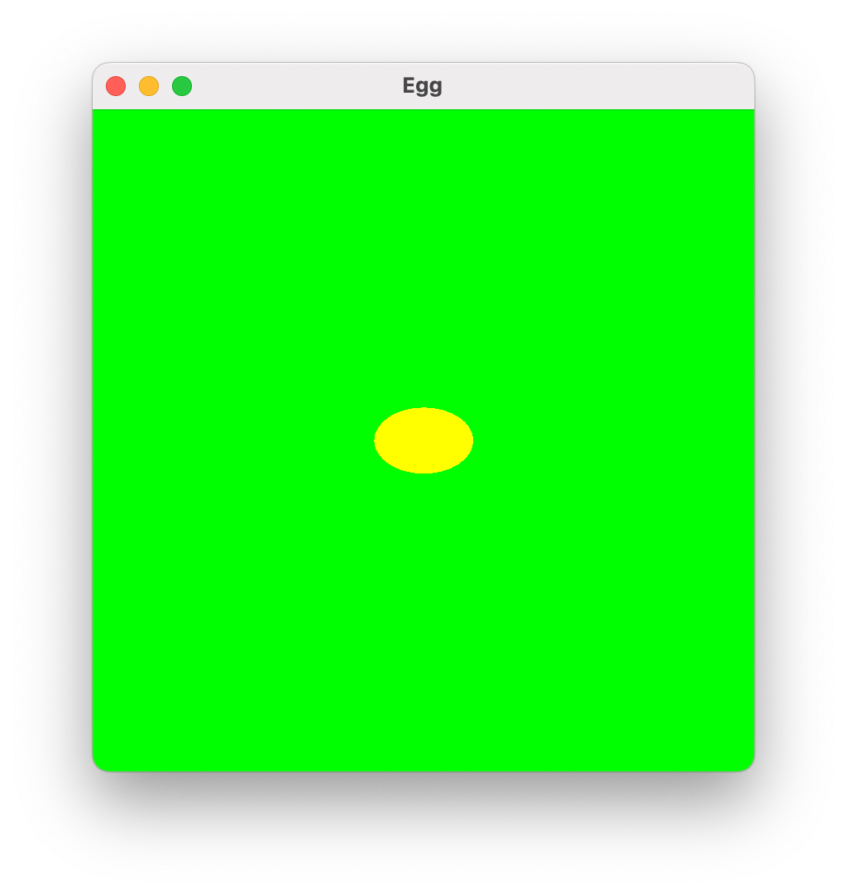
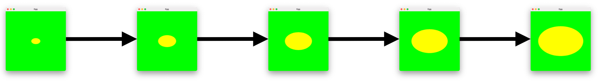
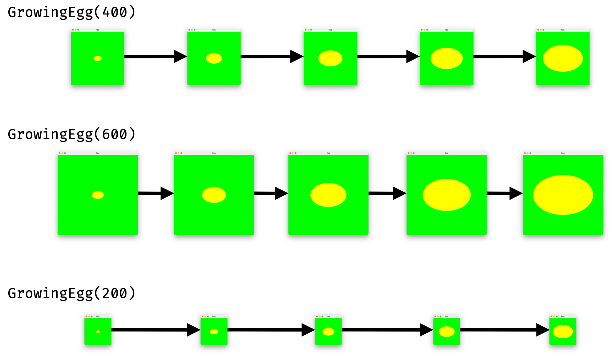
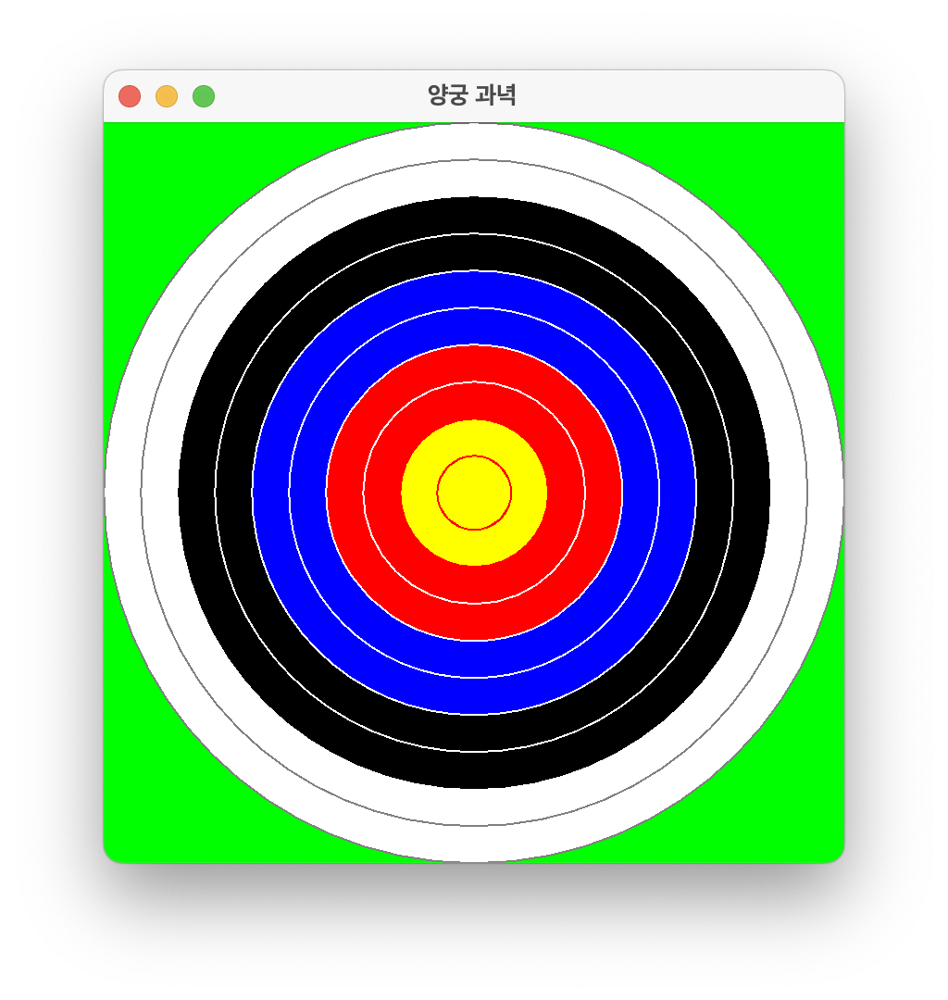

# [COM2018] 2025 Fall Object-oriented Programming
## School of Computer Science, College of Computing, Hanyang University ERICA

- Using the `Graphics` object and related methods from the `javax.swing` package, let’s draw an egg that gradually grows in size.
- Complete the exercise within the lab session and have it checked by the teaching assistant.

## [Lab 6-1] Drawing an Egg

- Create a class named GrowingEgg that satisfies the following:
    - Create a window of 400×400 pixels.
    - Display a yellow (Color.YELLOW) egg-shaped oval centered on a green (- r.GREEN) background.
    - The egg’s width is 60 pixels and height is 40 pixels.
    - The window title should be Egg.



```java
import java.awt.*;
import javax.swing.*;

public class GrowingEgg extends JPanel {

    public GrowingEgg() {
        JFrame f = new JFrame();
        // ...
    }

    public void paintComponent(Graphics g) {
        // ...
    }

    public static void main(String[] args) {
        new GrowingEgg();
    }
}
```

## [Lab 6-2] The Growing Egg

- Modify the `GrowingEgg` class to meet the following requirements:
    - When the window is minimized and then reactivated, the `paintComponent` method should automatically be called again to redraw the window.
    - Each time the window is reactivated, the egg should grow by 60 pixels in width and 40 pixels in height, as shown below.
    - The egg’s center must remain fixed at all times.



```java
import java.awt.*;
import javax.swing.*;

public class GrowingEgg extends JPanel {

    private final int NET_SIZE = 400;
    private int egg_width = 60;
    private int egg_height = 40;
    private int x = 170;
    private int y = 180;

    public GrowingEgg() {
        JFrame f = new JFrame();
        // ...
    }

    public void paintComponent(Graphics g) {
        // ...
    }

    public static void main(String[] args) {
        new GrowingEgg();
    }
}
```

## [Lab 6-3] Adjustable Egg

- Modify the `GrowingEgg` class to meet the following requirements:
    - Instead of fixing the window size to 400×400, allow the user to specify the size when creating the window, e.g., `GrowingEgg(400)`.
    - The egg’s initial size and its growth ratio should be proportional to the window size.
    - The egg’s center must always remain fixed.



```java
import java.awt.*;
import javax.swing.*;

public class GrowingEgg extends JPanel {

    // initialize NET_SIZE on constructor method
    private final int NET_SIZE;
    private int egg_width = 60;
    private int egg_height = 40;
    // initialize x, y on constructor method
    private int x;
    private int y;

    public GrowingEgg(int size) {
        JFrame f = new JFrame();
        // ...
    }

    public void paintComponent(Graphics g) {
        // ...
    }

    public static void main(String[] args) {
        new GrowingEgg(400);
    }
}
```

## [Lab 6-4] Drawing an Archery Target

- Using the GUI components and `while` loop learned today, draw an archery target as shown below.
- You may modify the target pattern freely if desired, but you should be able to explain your changes to the teaching assistant.



```Java
import javax.swing.*;
import java.awt.*;

public class Archery extends JPanel {
    private final int RINGS = 10; // number of circles
    private final int TARGET_DIAMETER;

    /* Constructor Archery - creates the archery target panel and adds it to the frame
     * @param d - target diameter */
    public Archery(int d) {
        TARGET_DIAMETER = d;
        JFrame f = new JFrame();
        f.getContentPane().add(this);
        f.setTitle("양궁 과녁");
        f.setSize(TARGET_DIAMETER, TARGET_DIAMETER + 28);
        f.setVisible(true);
        f.setDefaultCloseOperation(WindowConstants.EXIT_ON_CLOSE);
    }

    /* paintComponent - draws on the panel
     * @param g - graphics pen */
    public void paintComponent(Graphics g) {
        // fill green background
        g.setColor(Color.green);
        g.fillRect(0,  0, TARGET_DIAMETER, TARGET_DIAMETER);
        // ring spacing : OFFSET
        final int OFFSET = TARGET_DIAMETER / RINGS;
        int number = 1;
        int diameter = TARGET_DIAMETER;
        int new_x_position = 0;
        int new_y_position = 0;
        // draw from outermost ring to innermost ring
        while (number <= RINGS) {
            // loop invariant: number-1 rings have been drawn so far
            if (number <= 2) {
                // TODO: draw outer two rings with white fill and gray outline
                // ...
            }
            else if (number <= 4) {
                // TODO: draw next two rings with black fill and white outline
                // HINT: draw only one white outline
                // ...
            }
            else if (number <= 6) {
                // TODO: draw next two rings with blue fill and white outline
                // ...
            }
            else if (number <= 8) {
                // TODO: draw next two rings with red fill and white outlin
                // ...
            }
            else if (number <= 10) {
                // TODO: draw innermost ring with yellow fill and red outline
                // ...
            }
            // update x, y position, number, and diameter each iteration
            // ...
        }
    }

    public static void main(String[] args) {
        new Archery(400);
    }

}

```