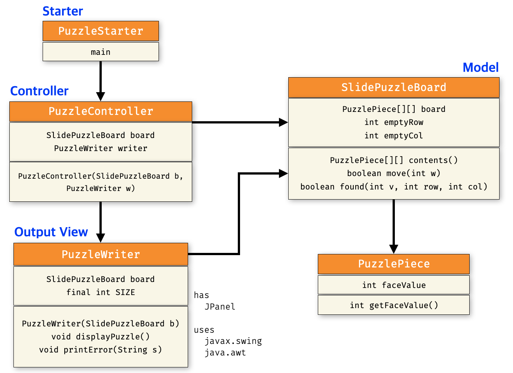

# [COM2018] 2025 Fall Object-oriented Programming
## School of Computer Science, College of Computing, Hanyang University ERICA

### Lab : Sliding Puzzle Game

- Create a "sliding puzzle game" using the arrays you learned last class.
- Complete it during lab time and have your TA inspect it.

Design based on the MVC architecture below and implement against the class diagram.



### Model class `PuzzlePiece`

This class is a model class for creating a piece of a puzzle. The face value of the puzzle is initialized in the constructor method.

| field | description |
|:---:|:---|
| `int faceValue` | The value that appears above the puzzle piece. |

| method | description |
|:---:|:---|
| `int getFaceValue()` | Returns the face value of the piece. |

### Model class `SlidePuzzleBoard`

This class is a model class for creating a puzzle board. In the constructor function, initialize `board` with the following algorithm.

- ~~Declare an integer local variable `number`, with an initial value of 1.~~
- ~~Iterate through the board from the last row to the first row.~~
    - ~~Repeat the following from the last column to the first column of the board.~~
        - ~~Create and place a new puzzle piece with a face value of `number` in `board[row][col]`.~~
        - ~~Increase the value of `number` by 1.~~
- When implementing the program, for convenience, the values are inserted in a predefined order as shown below.
```Java
    // Create size x size PuzzleBoard
    board = new PuzzlePiece[4][4];
    int idx = 0;
    // Placing the puzzle pieces in the predefined order
    int[] numbers = {1,2,3,4,5,6,7,8,9,10,13,14,11,12,15,0};
    for (int row = 0; row < 4; row++) {
        for (int col = 0; col < 4; col++) {
            board[row][col] = new PuzzlePiece(numbers[idx]);
            idx++;
        }
    }
    board[3][3] = null;
    emptyRow = 3;
    emptyCol = 3;
```

| field | description |
|:---:|:---|
| `PuzzlePiece[][] board` | Refers to a puzzle board. It consists of a two-dimensional array, used as `board[row][col]`. Initialized in the constructor function. |
| `int emptyRow` | Refers to the currently empty row of pieces on the puzzle board. |
| `int emptyCol` | Refers to the currently empty column of pieces on the puzzle board. |

| method | description | 
|:---:|:---|
| `PuzzlePiece[][] contents()` | Returns the puzzle board. |
| `boolean move(int w)` | Use the `found` method to check if there is a piece in the vicinity (top, bottom, left, right) of the blank on the current puzzle board that you want to move and attempt to move it. Returns `true` if the move is successful, or `false` if the move is not possible. |
| `boolean found(int v, int row, int col)` | Check if there is a puzzle piece `v` in `board[row][col]`. |

### Output-View class `PuzzleWriter`

This is the output view class that draws the puzzle board.

| field | description |
|:---:|:---|
| `SlidePuzzleBoard board` | Contains the puzzle board to be drawn. |
| `final int SIZE` | The size of the puzzle board. |
| `int getEmptyRow` | Refers to the currently empty row on the puzzle board. |
| `int getEmptyCol` | Refers to the currently empty column on the puzzle board. |

| method | description |
|:---:|:---|
| `int getFaceValue()` | Returns the integer value written on the puzzle piece. |

### Puzzle Controller class `PuzzleController`

This class controls the movement of a sliding puzzle piece. The constructor function takes in a puzzle board (`board`) to control and an output view class (`writer`) to initialize.
The `play` method is executed with the following structure.

- Draw the puzzle board in the output view class.
- Ask the user for the puzzle piece number to move.
    - Attempt to move that puzzle piece number.
    - If the puzzle piece number is unmovable, use the `printError` method to display the message "Unmovable." and take another puzzle piece number to move.
- The `JPanel.printError(String msg)` method displays a warning window containing `msg`.

| field | description |
|:---:|:---|
| `SlidePuzzleBoard board` | Contains the puzzle board to control. |
| `PuzzleWriter writer` | Contains the output view class that draws the puzzle board. |

| method | description |
|:---:|:---|
| `void play()` | Start a puzzle game. |

### Starter class `PuzzleStarter`

```java
public class PuzzleStarter {

    public static void main(String[] args) {
        SlidePuzzleBoard board = new SlidePuzzleBoard();
        new PuzzleController(board, new PuzzleWriter(board)).play();
    }
}
```
