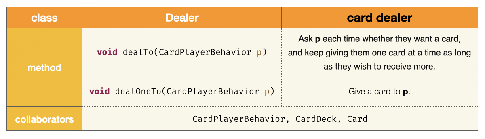
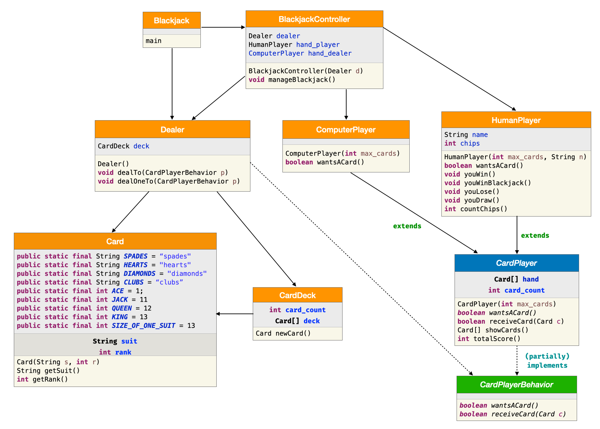

# [COM2018] 2025 Fall Object-oriented Programming
## School of Computer Science, College of Computing, Hanyang University ERICA

### Lab 1 : Understanding Inheritance

- Let’s review the concept of inheritance covered in today’s lecture.

```java
public class Person {
    private String name;

    public Person(String n) {
        name = n;
    }

    public String getName() {
        return name;
    }

    public boolean sameName(Person other) {
        return getName().equals(other.getName();
    }
}

public class PersonFrom extends Person {
    private String city;

    public PersonFrom(String n, String c) {
        super(n);
        city = c;
    }

    public String getCity() {
        return city;
    }

    public boolean same(PersonFrom other) {
        return sameName(other) &&
               city.equals(other.getCity());
    }
}

public class Main {
  public static void main(String[] args) {
    Person p = new Person("마음");
    Person q = new PersonFrom("소리", "서울");
    // ...
  }
```

Given the code above, review each of the following statements.
Determine which statements compile successfully and predict their output.

```java
/* 1 */ System.out.println(p.sameName(q));
/* 2 */ Person x = q; System.out.println(x.getName());
/* 3 */ PersonFrom x = p; System.out.println(x.getCity());
/* 4 */ Person x = q; System.out.println(x.getCity());
/* 5 */ System.out.println(q.same(p));
```

### Lab 2: Understanding instanceof

- Modify the previously used IntegerKey and StringKey classes so that they work with the following code.
- Predict what will be printed in the console when this code runs.

```java
Database db = new Database(4);

BankAccount a1 = new BankAccount(50000, new IntegerKey(55));
Key k = new StringKey("OpenSesami");
BankAccount a2 = new BankAccount(10000, k);
boolean transaction1 = db.insert(a1);
boolean transaction2 = db.insert(a2);

Record p = db.find(k);
BankAccount q = (BankAccount)p;
System.out.println(q.getBalance());

Key k = q.getKey();
if (k instanceof IntegerKey)
    System.out.println(((IntegerKey)k).getInt());
else if (k instanceof StringKey)
    System.out.println(((StringKey)k).getString());
else
    System.out.println("Unknown Key error");
```

### Lab 3: Implementing the Dealer Class

- Create a Dealer class that implements the following interface.

```java
public interface CardPlayerBehavior {
  /** wantsACard – decides whether to receive a new card.
   * @return true if the player wants a card, false otherwise */
  public boolean wantsACard();

  /** receiveCard – receives a card and adds it to the player’s hand.
   * @return true if the card is successfully received, false otherwise */
  public boolean receiveCard(Card c);
}
```



### Lab 4: Understanding the Blackjack Class Diagram

- Review the class diagram for the Blackjack game shown below.



Consider and discuss the following questions:
- What do the orange, blue, and green colors represent?
- When this program runs, which classes are instantiated using the `new` keyword?
- Which `class` is created only once, and which ones are created frequently?
- If we increase the number of players from one to two, what parts of the code need to change?
- If we want the program to accept a user input of 2–4 players, what parts of the code should be modified and how?