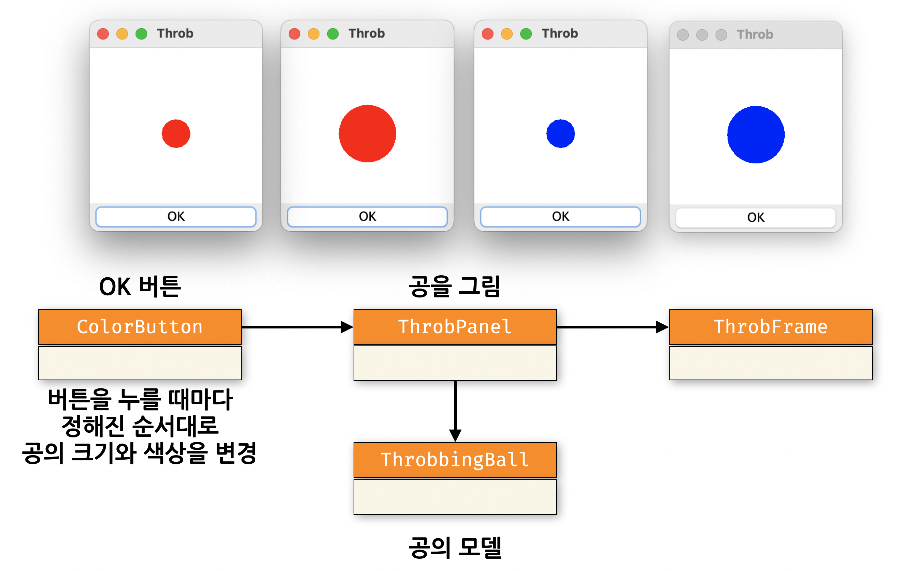

# [COM2018] 2025년도 가을학기 객체지향 프로그래밍
## 한양대학교 ERICA 소프트웨어융합대학 컴퓨터학부

### 실습1 : 크기와 색이 변하는 공

- 이번 주에 배운 `ActionListener`를 사용해서 크기와 색이 변하는 공을 그려봅시다.

아래와 같이 버튼을 누를 때마다 공의 크기와 색상을 바꾸는 프로그램을 만드려 합니다. 

아래는 코드의 클래스 다이어그램입니다. 

제공한 코드는 아래 그림에서 **AS-IS** 와 같이 공의 색상과 크기가 동시에 바뀝니다.
이를 **TO-BE** 와 같이 바뀌도록 코드를 수정해보세요.

아래 내용을 참고하세요.

- `ColorButton`은 오늘 배운 `ActionListener`를 상속받아 사용자가 버튼을 누르는 이벤트에 맞춰 동작합니다.
- `ColorButton`의 `actionPerformed(ActionEvent e)`는 이벤트가 발생할 때마다 공의 색상과 크기를 바꿉니다.
- `ThrobbingBall`의 `throb()`는 공을 크기가 큰지 여부(`isLarge`)를 변경합니다.
- **[중요]** `ThrobPanel` 의 `paintComponent` 는 `Panel` 을 어떻게 그릴지 구현하는 코드입니다.
- **[중요]** `JPanel` 을 (창크기 조절, 위치이동 등의 외부 요인 없이) 강제로 다시 그리도록 하려면 `repaint` 메소드를 호출하면 됩니다. 

### 실습2 : 퍼즐 게임 (GUI 버전)

- 지난 시간에 구현했던 퍼즐 게임을 GUI 버전으로 만들어 봅시다.
  아래 그림과 같이 퍼즐 보드의 각 퍼즐 조각(`PuzzlePiece`)을 버튼으로 구현하면 됩니다.

전체 코드의 클래스 다이어그램은 아래와 같습니다. `PuzzleButton`은 오늘 배운 `ActionListener`를
상속받아 사용자가 버튼을 누르는 이벤트에 맞춰 동작합니다.

