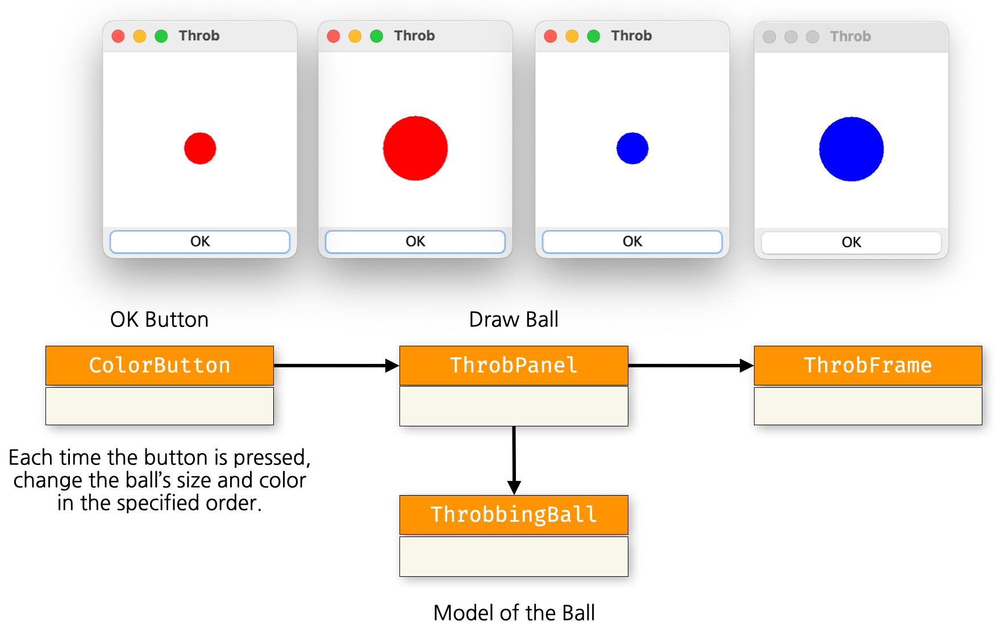
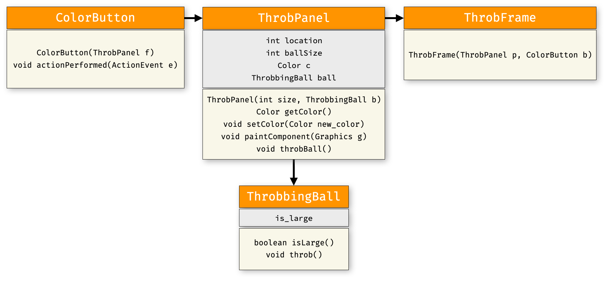
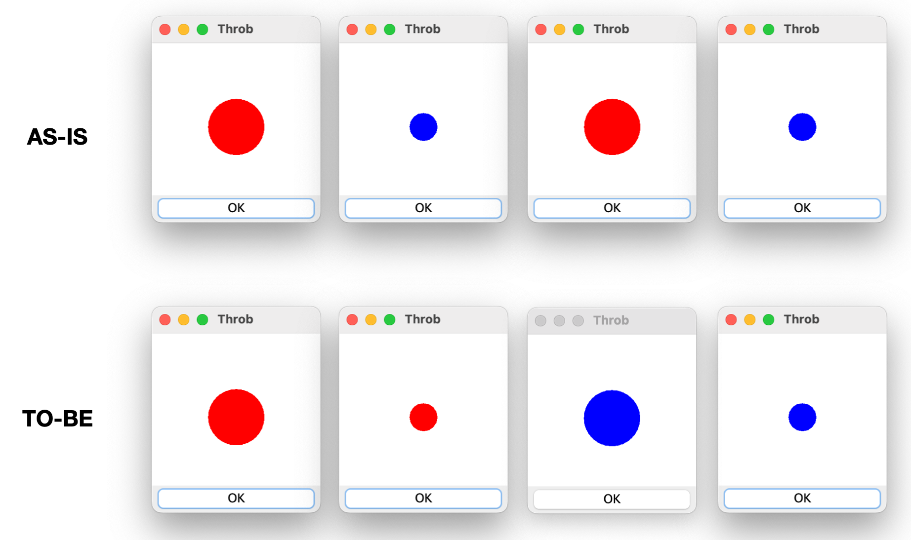
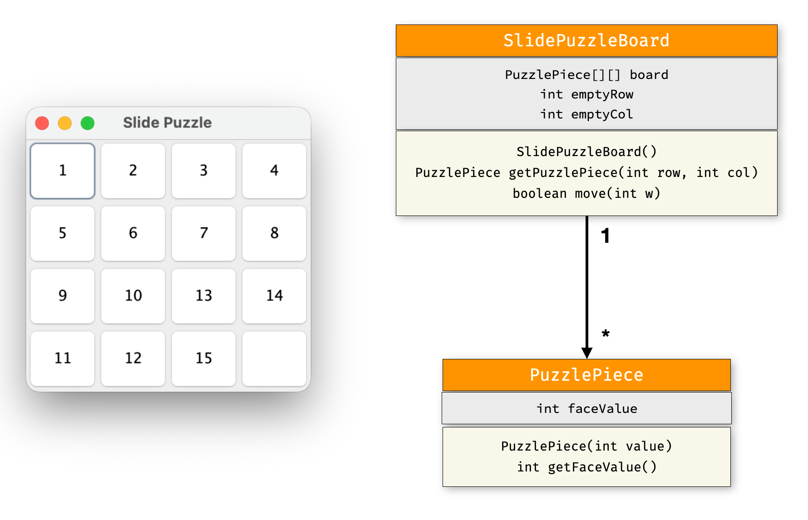
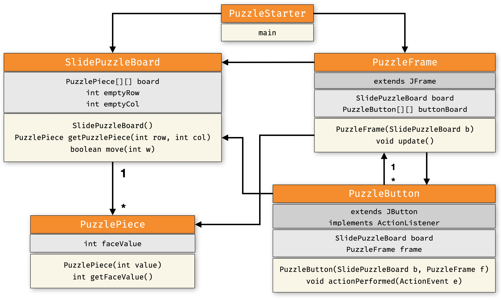

# [COM2018] 2025 Fall Object-oriented Programming
## School of Computer Science, College of Computing, Hanyang University ERICA

### Lab 1 : A Ball that Changes Size and Color

- Using the `ActionListener` covered this week, draw a ball that changes size and color.

Create a program that changes the ball’s size and color each time the button is pressed, as shown below.

The class diagram for the program is shown below.

In the provided code, as shown in **AS-IS**, the ball’s color and size change simultaneously.
Modify the code so that it behaves as in **TO-BE**, where the color and size change in sequence.

Implementation Guidelines

Implement `ColorButton` by inheriting the `ActionListener` interface.
- It should respond to the user's button-press events.
- In `ColorButton`, implement the `actionPerformed(ActionEvent e)` method so that it changes the ball’s color and size whenever an event occurs.
- In `ThrobbingBall`, the `throb()` method should toggle whether the ball is large (`isLarge`).
- **[Important]** The `paintComponent` method in `ThrobPanel` defines how the panel is drawn.
- **[Important]** To force a `JPanel` to redraw itself (without resizing or moving the window), use the `repaint()` method.

### Lab 2 : Slide Puzzle (GUI Version)

- Let’s turn the slide puzzle you implemented last time into a GUI version.
  As shown below, implement each puzzle piece (`PuzzlePiece`) on the board as a button.

The class diagram for the whole program is shown below.
`PuzzleButton` implements `ActionListener` and reacts to the user’s button-press events.

