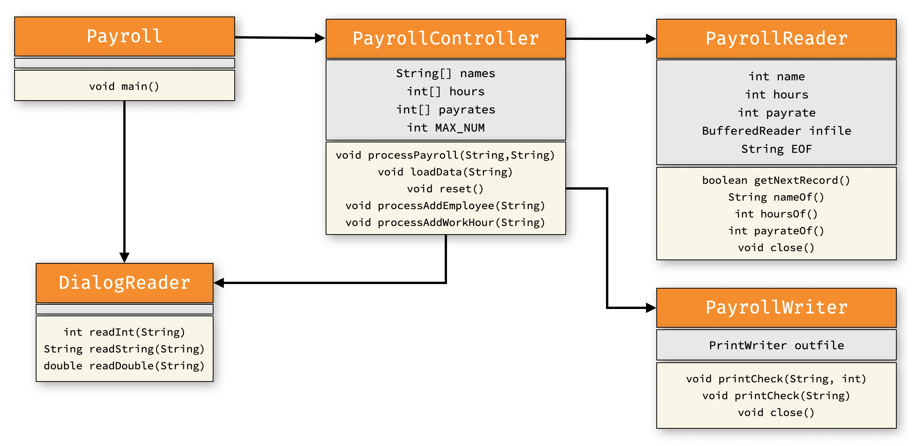
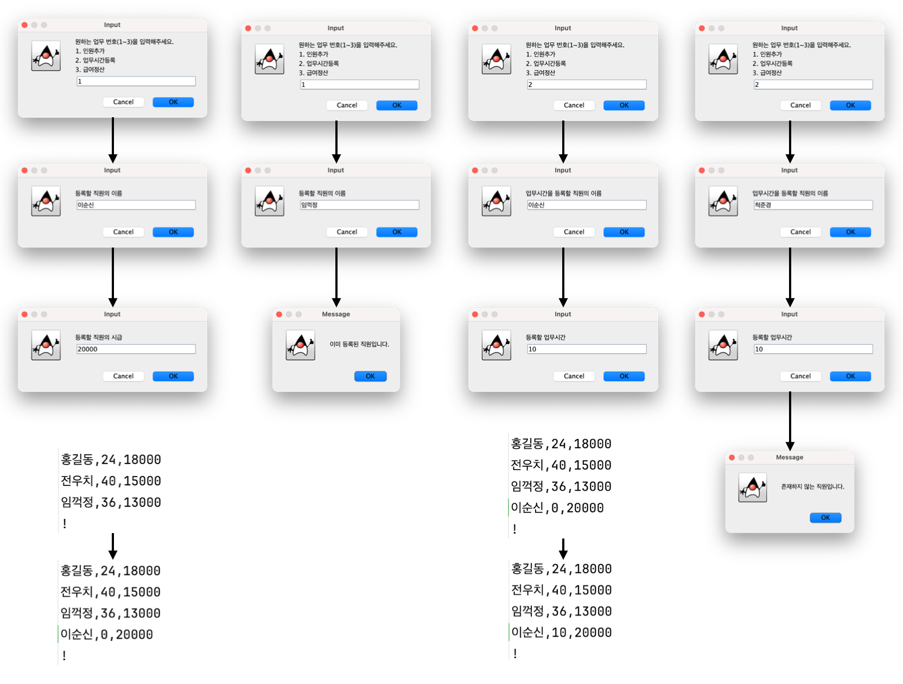

# [COM2018] 2025 Fall Object-oriented Programming
## School of Computer Science, College of Computing, Hanyang University ERICA

### Lab : Improving the Payroll Processing Program

Let’s improve the Payroll program we covered in the previous lecture as follows:
- Feature 1: Add a function to register a new employee
- Feature 2: Add a function to add work hours

Refer to the following class diagram:



- For convenience, the input and output file names have been fixed to `payroll.csv` and `payroll.out.csv`.
- DialogReader is used with static methods. You can invoke a method like `Dialog.readInt(prompt)`.

Addtions to `PayrollController`

- Field variables
    - `String[] names` : An array of employee names read by `PayrollReader`
    - `int[] hours` : An array of employee names read by `PayrollReader`
    - `int[] payrates` : An array of hourly pay rates read by `PayrollReader`
    - `final int MAX_NUM` : Maximum number of employees (fixed to `100`)

- Methods
    - `loadData(String in)` : Reads employee names, work hours, and hourly pay rates from the input file `in`, and stores them into the field variables `names`, `hours`, and `payrates`.
      When this method is executed, it must first call `reset()` to initialize the three arrays, and then proceed.
      The return value is the number of employees.
    - `reset()` : Initializes `names`, `hours`, and `payrates` as arrays of size` MAX_NUM`.
    - `processAddEmployee(String in)` : It adds a new employee by taking a name and payrate as input.
        - If the number of employees has reached the maximum limit (`MAX_NUM`), it should display a message indicating that no more employees can be added, and must not proceed with the addition.
        - If the entered employee name already exists, it should display a message indicating that the employee is already registered, and must not proceed with the addition.
        - In all other normal cases, it should update the input file (`in` = `payroll.`csv) using `PayrollWriter`.
    - `processAddWorkHour(String in)` : It adds work hours of existing employee by taking a name and work hours as input.
        - Work hours must be a non-negative integer, and the method should repeatedly prompt the user until such a value is entered.
        - If the entered name does not match any existing employee, it should display an appropriate error message.
        - If the employee exists, it should add the given work hours to that employee, and update the input file (`in` = `payroll.csv`) using PayrollWriter.

#### Examples of Execution Scenario



#### Safe Input Pattern

The code below is an example of repeatedly prompting the user until a valid input is received. Use this pattern in the following cases:
- Reading the task number (1–3) in `PayrollController`
- Reading the work hours (0 or greater) in `processAddWorkHour`

```Java
import labs.lab11.payroll.view.DialogReader;

public class SafeInputTest {
    static void main() {
        String input = DialogReader.readString("a or b ?");

        // target condition : "a".equals(input) || "b".equals(input)
        while (!("a".equals(input) || "b".equals(input))) {
            // loop invariant : !("a".equals(input) || "b".equals(input))
            input = DialogReader.readString("a or b ?");
        }

        System.out.println("your choice is : " + input);
    }
}
```
